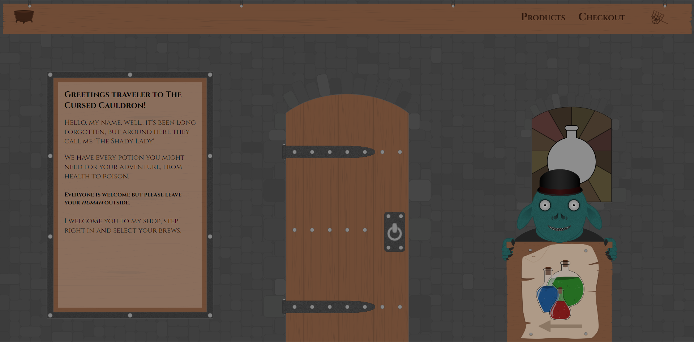
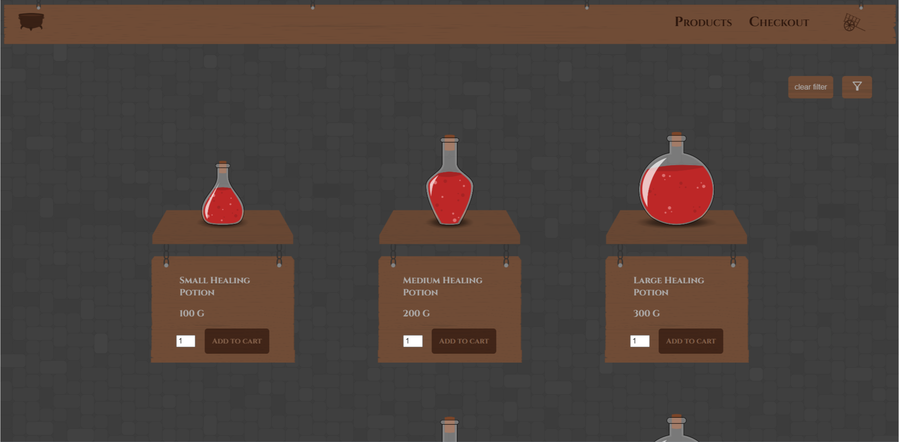
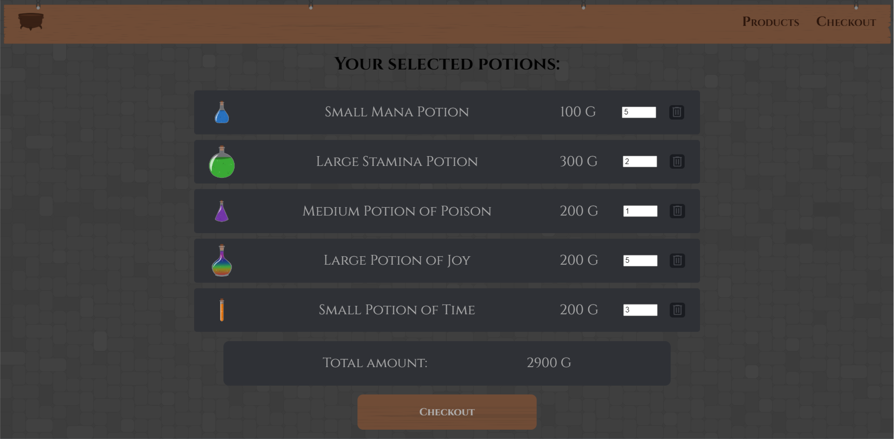

## School group assignment

Original project link: https://github.com/MarcusRei/grupp-8-potion-shop

#### Course

Agilt projektarbete (Agile project management) & Javascript Grundkurs (JS basic course)

#### School

Medieinstitutet in Stockholm

#### Assignment

To create an e-commerce

## Original group goals

We made an MVP (Minimal Viable Product) that we made from the requirements specifications of the assignment and prioritized it.

### Original team

- Marcus Reineck (https://github.com/MarcusRei/)
- Jennifer McAllister (https://github.com/jennifer-mcallister)
- Carolina Warntorp (https://github.com/Carowa27)

### Our lecturers and product owners

- Linda Mossberg
- Sebastian Tegel

## Requirements Specification:

- Landingpage
- Productpaeg
- Checkoutpage
- Shopping cart
- To be able to add products to the shopping cart
- Simulate that a purchase has been completed on the checkout page
- Calculate a total price for the products in the shopping cart
- That the information in the shopping cart is stored through extended objects, not just a product
- Being able to increase/decrease the number of products in the shopping cart
- Being able to increase/decrease the number of products on the checkoutpage
- The code must be very well structured, well formatted and contain good naming

## Our shop and ideas

We chose to create a shop that sells potions. Our inspiration is games, fantasy and medieval times

### Designs

All designs used are made by me, Carolina.

## Techniques and Tools

For project management we used the agile working method "Scrum" to keep a flexible project that we can adapt to the design of the product and the needs of the product owner.
We used Jira to manage the project. We planned, keept track of our tasks, planning and bugs and also our shared project documents.

For the coding part of the project we used VSCode and github. For a first time group assignment it had some ups and downs but once we all got a hang of it it turned out great!

### Languages

- Typescript
- Scss
- Html

## Screenshots

